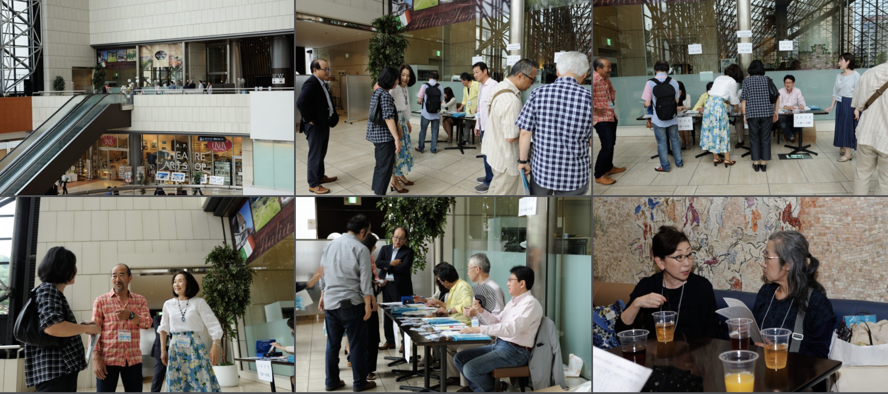
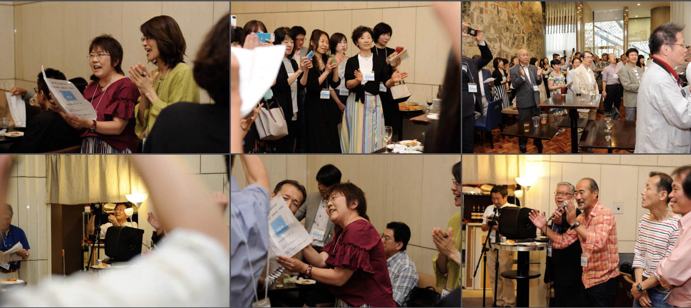
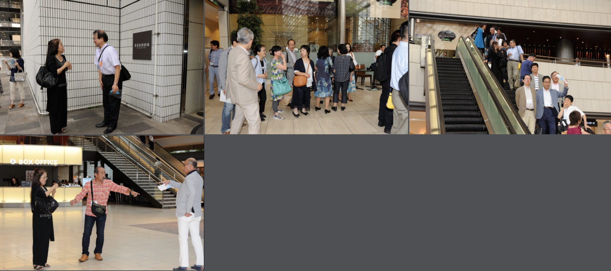

# shiba
<html lang="ja">
 <head>
  <meta charset="utf-8" />
 

<link href="https://cdnjs.cloudflare.com/ajax/libs/lightbox2/2.7.1/css/lightbox.css" rel="stylesheet">
   
</head>
<!--
<body onload="alert('2010年同期会の記録〜〜(^o^)/')" onunload="alert('再会の時まで、元気でお過ごしくださいませ〜(^o^)/')">
-->

  モバイル端末をお使いの場合は、画面を横向きにするとより見やすくご覧頂けます。

<h1><marquee behavior="alternate">!!! 大泉高校３０期、還暦祝い写真集 !!!</marquee></h1>

<a href="https://torokoid.github.io/home">Home</a>><a href="https://torokoid.github.io/oizumi">2019年同期会</a>><a href="https://torokoid.github.io/kanreki">還暦祝い＠池袋</a>>写真集

                              
<!--

 アクセス用QRコード

<marquee direction="right" scrollamount="20" width="30%">(^_^)/~hada</marquee>

<h2><marquee behavior="alternate">!!! 2019年6月1日、還暦祝い@池袋 !!!</marquee></h2>
-->

３組柴崎さん提供

<h2>
<a href="https://nis.nikonimagespace.com/html/guest/ja/auth.html?g=Cykf7OF14D_qxGlWtP6wB-6au0bjRYfqZexrezV_RT9rzex5pQuo27E_bCvyiulkCc6NxTBMjcdqv-FUyE97Cw" target="_blank">３組、柴崎さん元画像リンク</a>
PassWD"ohizumi30"

 
<a href="https://photos.google.com/share/AF1QipO8O4Hsh-J1sTwbm91kvdOz9Q9JOa34rA6A_WmYvPvtwnNMuxxitry1Qi2hmw1BZg?key=SmYxZVRuaXMxazlGd0h4WWI3a2Z0ZWhoalAwVU5n" target="_blank">３組、長野さん、３組、Bruce東さん配信画像リンク</a>
PassWD無し

</h2>

                   
<section>
<!-- begin wwww.htmlcommentbox.com -->
 
<a href="http://www.htmlcommentbox.com">HTML Comment Box</a> is loading comments...

 <link rel="stylesheet" type="text/css" href="//www.htmlcommentbox.com/static/skins/bootstrap/twitter-bootstrap.css?v=0" />
 
<!-- end www.htmlcommentbox.com -->
</section>

                             
          

<a href="https://torokoid.github.io/oizumi">大泉高校30期のHP　← リンクあり</a>

  

<!-- フッタ -->
 <footer>
 Copyright 2019/06/03 Pe-Young(S.Hada)
 </footer>
